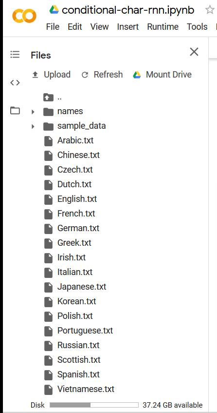

## Lab 09: Using RNN to learn to generate text sequences 
In this lab we will learn how we can learn from a dataset to generate some sequences using RNN. It will work at character level so it will definitely generate a lot of words that doesnt make any sense. 
It is based on this tutorial [here](https://github.com/spro/practical-pytorch/blob/master/conditional-char-rnn/conditional-char-rnn.ipynb).
There is a website system build on top of it [babyname](https://www.babyname.ai/)

The network learns to predict the next character from a given sequence of characters for each categories (e.g. Given an input JOHN, it will learn to predict O when J is given, H when JO is given). That's why we need to provide the beginning character of the name generate to get full names. The ending of each name squence is also a (a bit special) character.

## Tasks 
1. Run the notebook provided. To make the code in the lab work please upload all the text files of names to the [root] directory where your notebook is. Luckily the upload tools allows uploading of multiple files at once. Use Ctr+A to select all files in the folder to upload. It will look like this . Make sure you configure GPU acceleration in the notebook settings (Edit>Notebook Setting)
2. Adjust the `temperature` argument to see how generation is affected 
3. Try with a different dataset of category -> line, for example:
    * Fictional charater names 
    * Gamer tags 
    * Nordic names

